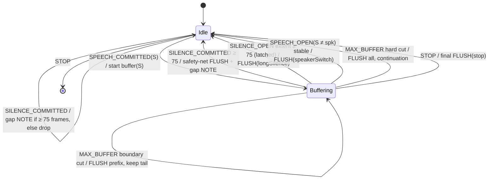
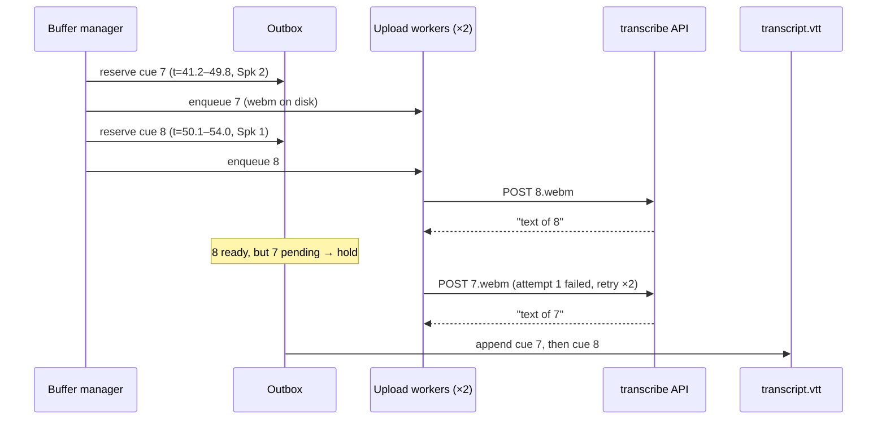

# Simbi Live Recording Algorithm

This document specifies the live recording pipeline of SimbiAudio **exactly**:
capture → diarization → cut-point detection → segment buffering → transcription
upload → WebVTT append, plus stop/resume and failure handling. It is
self-contained — an engineer can implement the pipeline from this document
alone. Where SPEC.md §3 was ambiguous or contradicted the FluidAudio library,
the resolution is made here and marked with a `> **Resolution:**` blockquote.

All arithmetic is in **frames** (80 ms) and **samples** (16 kHz mono) unless a
rule is explicitly in seconds.

---

## 0. Verified FluidAudio facts

Everything below was verified against FluidAudio source
(`Sources/FluidAudio/Diarizer/Sortformer/*.swift`,
`Sources/FluidAudio/Diarizer/DiarizerTimeline.swift`), not the docs. The
implementation must not assume anything beyond this list.

1. `SortformerConfig.fastV2_1` exists: `chunkLen = 6`, `chunkLeftContext = 1`,
   `chunkRightContext = 7`, `sampleRate = 16000`, `subsamplingFactor = 8`,
   `melStride = 160`, `numSpeakers = 4`.
   Frame duration = `8 × 160 / 16000` = **exactly 0.08 s** (1280 samples).
   Output latency = `(chunkLen + rightContext) × 0.08` = **1.04 s**.
2. `SortformerDiarizer.process()` returns `DiarizerTimelineUpdate?` — `nil`
   until a full chunk of features is available. Finalized frames therefore
   arrive in **bursts of 6 frames (480 ms)** or multiples.
3. `DiarizerTimelineUpdate.chunkResult` carries the raw finalized
   probabilities: `finalizedPredictions: [Float]` flattened
   `[frameCount, 4]`, plus `startFrame` = the session-local index of the
   first finalized frame in this update. Frame indices are **session-local**
   (they restart at 0 after `reset()` / a new diarizer instance).
4. Finalized frames are immutable — `StreamingUpdateResult.confirmed` "are
   final and will not change." Tentative predictions cover the right-context
   window and are replaced on every chunk.
5. `DiarizerTimelineConfig.sortformerDefault` has **no debounce**:
   `onset/offset = 0.5`, `minFramesOn = 0`, `minFramesOff = 0`.
   > **Resolution:** SPEC.md §3.2 assumed the library defaults to
   > `minDurationOn = 0.25 s` / `minDurationOff = 0.1 s`. It does not — those
   > numbers were a docs example. Simbi implements its own debounce (the run
   > smoother, §5). The library timeline's segment extraction is used **only**
   > for the tentative live-UI indicator, never for cut decisions.
6. The timeline's own segment emission (`finalizedSegments` in updates) lags:
   a closed segment is held internally and only emitted on a later
   large-gap onset or batch-end condition, per speaker slot independently.
   > **Resolution:** the cut-point engine consumes
   > `chunkResult.finalizedPredictions` (raw per-frame probabilities) and
   > derives its own labels/segments. It does **not** consume
   > `update.finalizedSegments`.
7. `finalizeSession()` drains only **full right-context chunks** and then
   absorbs the remaining tentative predictions as finalized. It does *not*
   pad trailing silence (older docs claim it does). Audio in the last
   ≲ 0.5 s may otherwise never be processed with full context.
   > **Resolution:** on stop, Simbi feeds `STOP_PAD_SEC` of zero samples to
   > the diarizer (only to the diarizer — never to `audio.webm` or the ring
   > buffer) before calling `finalizeSession()`, so every real sample is
   > covered by a full-context chunk. Frames at or beyond the end of real
   > audio are force-labeled SILENCE (§10.1).
8. `SortformerDiarizer` serializes access with an internal lock, but the
   type is documented "not thread-safe". All diarizer calls happen on the
   single pipeline actor (§2) regardless.

Recommended construction:

```swift
let diarizer = SortformerDiarizer(
    config: .fastV2_1,
    timelineConfig: DiarizerTimelineConfig(
        numSpeakers: 4,
        frameDurationSeconds: 0.08,
        minFramesOn: 3,      // cosmetic: smooths the tentative live-UI only
        minFramesOff: 1,     // cosmetic
        maxStoredFrames: 0,  // don't accumulate prediction history
        storeSegments: false // we never read per-speaker stored segments
    )
)
```

`maxStoredFrames: 0` + `storeSegments: false` keep the library timeline O(1)
in memory; the cut engine keeps its own state.

---

## 1. Constants

Every threshold in this document, in one place. Frame counts are the
normative values; the seconds column is informative.

| Constant | Value | Seconds | Meaning |
|---|---|---|---|
| `SAMPLE_RATE` | 16 000 Hz | — | pipeline sample rate (mono Float32) |
| `FRAME_SAMPLES` | 1 280 | 0.08 | one diarizer output frame |
| `ACTIVE_PROB` | 0.5 | — | slot active if p ≥ ACTIVE_PROB |
| `MIN_SPEECH_FRAMES` | 3 | 0.24 | shorter speech runs are absorbed (intent: 0.25 s) |
| `MIN_SILENCE_FRAMES` | 2 | 0.16 | shorter silence runs are absorbed (intent: gaps < 0.1 s close; 1 frame = 80 ms is absorbed, 2 frames = 160 ms stands) |
| `SILENCE_DISCARD_FRAMES` | 75 | 6.00 | silence ≥ this: flush buffer, discard the silence's middle, emit `NOTE gap` |
| `SILENCE_PAD_FRAMES` | 25 | 2.00 | silence kept in the UPLOAD at each edge of a discarded gap (cue extents unaffected) |
| `MAX_BUFFER_FRAMES` | 125 | 10.00 | flush when buffered speech+glue reaches this |
| `FLUSH_LOOKBACK_FRAMES` | 37 | 2.96 | boundary search window for the MAX_BUFFER cut |
| `STOP_PAD_SEC` | 2.0 | 2.0 | zeros fed to the diarizer (only) at stop |
| `RING_TARGET_SEC` | 15 | 15.0 | ring buffer target retention (growable, §8) |
| `UPLOAD_CONCURRENCY` | 2 | — | parallel uploads |
| `UPLOAD_MAX_ATTEMPTS` | 3 | — | per segment |
| `UPLOAD_BACKOFF` | 1 s, 4 s | — | delay before attempts 2 and 3 |
| `UPLOAD_TIMEOUT_SEC` | 30 | — | per HTTP request |
| `OPUS_BITRATE` | 24 000 bps VBR | — | mono, 20 ms Opus frames, WebM container |

Frame → time mapping (**normative**):

```
frame f (session-local) covers samples [f·1280, (f+1)·1280)   (session-local)
note_time_seconds(f_start_edge) = session_base_seconds + f · 0.08
session_base_seconds            = session_base_samples / 16000
session_base_samples            = total samples written to audio.webm by all
                                  previous sessions (0 for session 1)
```

VTT timestamps are formatted from seconds with millisecond rounding:
`ms = round(seconds × 1000)`.

---

## 2. Architecture and dataflow

Single-writer design: everything after capture runs on **one pipeline actor**
processing events in order. There are no cross-thread races by construction;
"race conditions" in the cut logic reduce to event-ordering rules (§7).

```mermaid
flowchart LR
    MIC["Mic tap\n(AVAudioEngine)"] --> MIX
    SYS["System audio tap\n(CoreAudio process tap)"] --> MIX
    MIX["Mixer\nresample to 16 kHz mono,\nsum + soft-clip limiter"] -->|"PCM batches\n(realtime)"| PA

    subgraph PA["Pipeline actor (single-threaded event loop)"]
        direction TB
        RING["Ring buffer\n(PCM, in memory only)"]
        WEBM["audio.webm writer\n(Opus/WebM live mode)"]
        DIA["SortformerDiarizer\n.fastV2_1 (~1.04 s lag)"]
        LAB["Frame labeler (§4)"]
        SMO["Run smoother (§5)"]
        BUF["Buffer manager (§6)"]
        DIA -->|"finalized preds\n(bursts of 6 frames)"| LAB --> SMO -->|"committed runs +\nopen-run progress"| BUF
        BUF -->|"slice PCM"| RING
    end

    PA --> RING & WEBM & DIA
    BUF -->|"encoded segment +\nsidecar json"| PEND[".simbi/pending/\n(disk queue)"]
    PEND --> UP["Upload workers ×2\n(Opus/WebM → transcribe API)"]
    UP -->|"text / terminal failure"| OUTBOX["Ordered outbox (§9)"]
    BUF -->|"NOTE gap / session"| OUTBOX
    OUTBOX -->|"strictly in-order append"| VTT["transcript.vtt"]
```



Each incoming PCM batch is delivered to exactly three sinks, in this order:

1. **Ring buffer** (`§8`) — raw samples, memory only.
2. **audio.webm writer** — samples → Opus → WebM cluster append. This file is
   the timestamp ground truth; it contains *all* audio including silences.
3. **Diarizer** — `addAudio()` then `process()`; a non-nil update feeds the
   cut engine.

---

## 3. Data model and invariants

**Frame label** — per finalized frame: `SILENCE` or `SPEECH(slot)` with
`slot ∈ {0,1,2,3}`.

**Run** — maximal sequence of consecutive frames with the same label, produced
by the smoother. `run = {label, startFrame, endFrame}` (`endFrame` exclusive).
Invariants after smoothing:
- Committed runs strictly alternate speech/silence… of *some* kind: two
  adjacent committed runs never have the same label.
- Committed speech runs have length ≥ `MIN_SPEECH_FRAMES`.
- Committed silence runs have length ≥ `MIN_SILENCE_FRAMES`.
- Committed runs are immutable and tile the frame axis with no gaps.

**Upload buffer** — at most one, owned by the buffer manager:
`buffer = {speaker, items: [run-slice…], startFrame}`. Invariants:
- All speech items share one `speaker`.
- Items are contiguous in frame order except across an item that was
  trimmed (never happens mid-buffer; trims only occur at flush).
- Silence items ("glue") are each `< SILENCE_DISCARD_FRAMES` long and are
  never first (leading silence is dropped) — they always sit between two
  speech items of the same speaker, or last (then trimmed at flush).
- `speechFrames(buffer) ≥ MIN_SPEECH_FRAMES` at any flush that produces a cue.
- `uploadStart` = `startFrame`, or `startFrame − SILENCE_PAD_FRAMES` when the
  buffer opened exactly where a discarded gap ended (leading pad, §6.3).

**Cue** — one flushed buffer. `cue = {index, startSec, endSec, speaker,
continuation, text?}`. Invariants:
- `index` is a monotonically increasing integer, unique across all sessions
  of the note (persisted as `nextCueIndex` in `.simbi/state.json`).
- `startSec` = note time of the first buffered frame; `endSec` = note time of
  the end of the last **speech** frame (trailing glue trimmed), clamped to
  `realAudioEndSec` (§10.1).
- Cues never overlap and are strictly increasing in `startSec` in file order.

**Gap** — a discarded silence: `{startSec, endSec}` with duration ≥ 6.0 s
(or ≥ 75 frames measured at commit). Rendered as a `NOTE gap` block covering
the WHOLE silence. The audio of a gap exists in `audio.webm`; it is simply
not covered by any cue. The uploads adjacent to a gap each carry
`SILENCE_PAD_FRAMES` (2 s) of the gap's edge audio — the trailing pad keeps
the pause natural for the ASR, and the leading pad recovers speech the
diarizer detected late after a long silence (its onset probability ramps up
over ~0.5–1 s, which would otherwise clip the first words of resumed
speech). Pads never overlap: a gap is ≥ 6 s, the two pads total 4 s.

**Session** — one start/stop of recording. `{n, baseSamples, wallStart,
wallEnd}`. Note-timeline is contiguous across sessions: session n+1's frame 0
maps to `baseSeconds = baseSamples/16000`, immediately after session n's last
sample.

---

## 4. Frame labeling

Input: one finalized frame's probabilities `p[0..3]` from
`chunkResult.finalizedPredictions`.

```
active = { s | p[s] ≥ ACTIVE_PROB }            # ACTIVE_PROB = 0.5
label  = SILENCE                if active == ∅
       = SPEECH(argmax_s p[s])  otherwise      # tie → lowest slot index
```

> **Resolution:** SPEC.md §3.2 defined the current speaker under overlap as
> "the slot with the higher mean probability over the overlapping window",
> with no window defined. Replaced by: per-frame argmax over active slots,
> with flicker suppressed by the run smoother (§5). A momentary argmax flip
> shorter than `MIN_SPEECH_FRAMES` is absorbed; a sustained flip is a real
> speaker switch. This is deterministic and needs no window parameter.

No probability smoothing is applied; all debouncing happens at the run level.

---

## 5. Run smoother

Converts the per-frame label stream into **committed runs** plus **open-run
progress** events. It is the only component that may relabel frames; after
it, everything is exact bookkeeping.

State: `current` (the open run) and `pending` (closed runs not yet committed,
oldest first — in practice length ≤ 1, but the algorithm below is stated
generally).

`minLen(label)` = `MIN_SPEECH_FRAMES` for speech, `MIN_SILENCE_FRAMES` for
silence.

**push(f, L)** — called for every finalized frame in order:

```
if current == nil:
    current = {label: L, start: f, end: f+1}; return
if L == current.label:
    current.end = f+1
    emit openRunProgress(current)              # see gating below
    return

# label changed: close current, open new
pending.append(current)
current = {label: L, start: f, end: f+1}

# immediate absorption of the just-closed run if too short
R = pending.last
if R.length < minLen(R.label):
    prevLabel = label of run before R          # last pending before R,
                                               # else last committed run,
                                               # else SILENCE (virtual run
                                               # before frame 0)
    relabel R to prevLabel and merge R into that predecessor
    # merging may make `current`'s predecessor share current's label:
    if predecessor.label == current.label:
        merge current into predecessor; current = predecessor (reopened)
        pending.remove(predecessor)            # it is open again
        emit openRunProgress(current)          # length may have jumped past
                                               # a threshold — see gating

# commit rule: a pending run is immutable once its successor has reached
# its own min length (the successor can no longer be absorbed backwards)
while pending.first != nil
      and successor(pending.first).length ≥ minLen(successor.label):
    emit runCommitted(pending.removeFirst())
```

**Open-run progress gating:** `openRunProgress(current)` is emitted only once
`current.length ≥ minLen(current.label)` — before that, the run might still
be absorbed, so its label is not yet trustworthy. Once past its min length a
run can grow but can never change label or start. Consequently:

- A **silence** open run's extent is trustworthy from 2 frames on → used for
  the 2 s discard check.
- A **speech** open run's speaker is trustworthy from 3 frames on → used for
  the speaker-switch and 10 s checks.

**Progress events do not visit every integer length.** A reopen-merge
(above) can advance a run's length by several frames between two consecutive
progress emissions — and the reopened run may even close before another
same-label frame arrives, emitting no further progress at all. Downstream
threshold checks MUST therefore be **latched `≥` comparisons** (fire once
per run, the first time the threshold is reached or exceeded), never `==`
equality checks — and each latched action needs a commit-time safety net for
the close-before-progress case (§6.1).

Edge cases (all follow mechanically from the rules above):

| Input pattern | Outcome |
|---|---|
| speech starts at f = 0 | virtual SILENCE predecessor; speech run stands normally |
| ≤ 2-frame speech blip inside silence | relabeled SILENCE, merged; never seen downstream |
| 1-frame silence inside A's speech | relabeled A, merged: one continuous A run |
| A → B direct, no silence, B sustained | A run closes at the flip frame; commits when B reaches 3 frames |
| A(long) B(≤2 frames) A(long) | B relabeled A; all three merge into one A run |
| A(long) B(≤2 frames) C(long) | B relabeled A (predecessor), merges into A; then A→C switch at C's start |
| alternating sub-min flicker | keeps chain-absorbing into the last stable run; commits resume at the next stable run (decision latency grows with the flicker length — acceptable; this is pathological audio at p ≈ 0.5) |

Decision latency budget: diarizer finalization 1.04 s + burst granularity
0.48 s + successor-min gating ≤ 0.24 s ⇒ a cut decision lands ≤ ~1.8 s after
the audio instant it refers to. The 1-second-latency feel comes from the
diarizer; the extra ≤ 0.7 s is bookkeeping delay on top, invisible to the
user because cues only appear when transcription returns anyway.

---

## 6. Buffer manager

Consumes smoother events; owns the upload buffer; decides flushes.



### 6.1 Event handlers (normative)

`runCommitted(run)`:

- `run.label == SPEECH(S)`:
  1. If buffer non-empty and `buffer.speaker ≠ S`: `flush(.speakerSwitch)`.
     (Normally already flushed by the open-run stable check; this is the
     safety net for bursts.)
  2. If buffer empty: start buffer with `speaker = S`,
     `startFrame = run.start` — **but** if part of this run was already
     flushed by a MAX_BUFFER hard cut (`openConsumedUpTo > run.start`), only
     the remainder `[openConsumedUpTo, run.end)` is appended.
  3. Append the (remaining) run as a speech item. Run `checkMaxBuffer()`.
- `run.label == SILENCE`:
  1. If `run.length ≥ SILENCE_DISCARD_FRAMES`: if the buffer is non-empty,
     `flush(.longSilence)` **first** (safety net — the run can close before
     its latched ≥ 75 progress event ever fires, e.g. a reopen-merge jumps
     the length past 75 and a label change follows immediately; flushing
     before emitting the gap keeps outbox entries in timestamp order).
     Then emit `NOTE gap [noteTime(run.start), noteTime(run.end))` to the
     outbox and remember `run.end`: the next buffer to open exactly there
     gets the leading upload pad (§6.3). Normally the buffer was already
     flushed when the open run crossed 75 frames. Do not append anything.
  2. Else (short silence): if buffer non-empty **and** the successor run —
     which is known at commit time, since a run commits only when its
     successor is stable — is `SPEECH(buffer.speaker)`: append as glue.
     Otherwise drop it (leading silence, or silence before a different
     speaker; the speaker-switch flush's trailing-trim makes this case moot).

> **Resolution:** SPEC.md said short silences "glue adjacent same-speaker
> speech" but did not say how the manager can know, at silence time, who
> speaks next. Answer: it always knows — a silence run only *commits* when
> the following run is already stable (§5 commit rule), so the successor's
> label is available at the only moment the decision is made.

`openRunProgress(run)` (only fires once past min length, §5):

- `run.label == SILENCE` and `run.length ≥ SILENCE_DISCARD_FRAMES` and
  buffer non-empty: `flush(.longSilence)`. (Latched: fires at most once per
  run, the first time its length reaches **or exceeds** the threshold — a
  reopen-merge can jump the length past 75 without ever equalling it, §5.)
- `run.label == SPEECH(S)`, `S ≠ buffer.speaker`, buffer non-empty, and
  `run.length ≥ MIN_SPEECH_FRAMES` (latched, once per run):
  `flush(.speakerSwitch)`. This is the primary switch cut: it fires ~3
  frames after the flip rather than waiting for the run to commit. (If the
  latch never fires because the run closed early, the `SPEECH_COMMITTED`
  safety net above catches the switch at commit time.)
- `run.label == SPEECH(buffer.speaker or buffer empty)`: run
  `checkMaxBuffer()` counting the open extent (see below).

`stop` (§10): force-close `current`, commit all pending, then
`flush(.stop)`; emit trailing `NOTE gap` if the final silence ≥ 75 frames.

### 6.2 `checkMaxBuffer()`

```
openExtent = (current run is SPEECH with speaker == buffer.speaker,
              length ≥ MIN_SPEECH_FRAMES)
             ? current.end - max(current.start, openConsumedUpTo) : 0
total = buffer.frameCount + openExtent          # includes glue frames
if total < MAX_BUFFER_FRAMES: return

bufEnd = buffer.endFrame + openExtent
B = latest item boundary in buffer (incl. boundary between last item and
    the open run) with bufEnd - B ≤ FLUSH_LOOKBACK_FRAMES and B > buffer.startFrame
if B exists:
    flushPrefix(upTo: B, reason: .maxBuffer)    # items ≥ B stay buffered
else:
    # hard cut through the open run
    cut = current.end                            # newest stable frame
    append open-run slice [max(current.start, openConsumedUpTo), cut) to buffer
    openConsumedUpTo = cut
    flush(.maxBuffer)                            # empties the buffer
```

Either variant sets `pendingContinuation = buffer.speaker`; the next flush
emits its cue as a continuation **only if** that cue's speaker matches
(§6.3 steps 2, 7 and 10 — the marker never leaks onto another speaker's cue
and never survives a flush that produced no cue).

> **Resolution:** SPEC.md's "buffered duration ≥ 10 s" was undefined when a
> single uninterrupted speech run never produces a closed segment (the buffer
> would be empty forever). Resolved: buffered total = closed items + the
> stable open-run extent, and a hard cut may split the open run *at the
> buffer level* (the smoother's run is untouched; `openConsumedUpTo` tracks
> what was already shipped).

> **Resolution:** SPEC.md v0.3's "prefer the most recent intra-run micro-pause
> (≥ 0.3 s)" predates sensitive cutting — with every silence↔speech transition
> now being a run boundary, "micro-pauses" *are* item boundaries. The rule is
> restated as: cut at the latest item boundary within `FLUSH_LOOKBACK_FRAMES`
> of the buffered end, else hard-cut.

Because finalized frames arrive in bursts of 6, `total` can overshoot
`MAX_BUFFER_FRAMES` by up to 5 frames (400 ms) before the check runs. This is
by design; no compensation is applied.

### 6.3 `flush(reason)` (and `flushPrefix`)

```
1. Trim trailing SILENCE items from the buffer (they stay on the note
   timeline; they are just not uploaded and not covered by the cue).
2. If speechFrames(buffer) == 0: clear buffer; pendingContinuation = nil;
   return (no cue). Every flush attempt consumes the pending continuation —
   the speech stream broke, so the next cue never continues mid-sentence.
3. cueIndex = nextCueIndex++            # persisted counter
4. startSec = noteTime(buffer.startFrame)
   endSec   = min(noteTime(buffer.endFrame), realAudioEndSec)
5. uploadStart = buffer.uploadStart          # §3: startFrame, or 2 s earlier
   #                                            when opening after a gap
   uploadEnd   = (reason == .longSilence)
                 ? min(endFrame + SILENCE_PAD_FRAMES, realFrameEnd)
                 : endFrame                   # trailing pad into the silence
   PCM = ring.slice(uploadStart · 1280, uploadEnd · 1280)
   # one contiguous slice: buffer items are contiguous (§3), so embedded
   # glue silences are included — natural audio for the ASR. The pads are
   # upload-only: steps 4's cue extents are what the VTT renders.
6. webm = opusWebmEncode(PCM)
7. persist .simbi/pending/{cueIndex}.webm and {cueIndex}.json
   {cueIndex, startSec, endSec, speaker,
    continuation: (pendingContinuation == buffer.speaker), attempts: 0}
8. outbox.reserve(cueIndex)             # ordering slot (§9)
9. uploadQueue.enqueue(cueIndex)
10. pendingContinuation = (reason == .maxBuffer) ? buffer.speaker : nil
11. clear buffer (flushPrefix: drop only items before the cut frame and set
    buffer.startFrame to the cut frame)
12. ring.setEvictionFloor(§8)
```

The cue's speaker label is `Speaker {slot+1}` (slots 0–3 → "Speaker 1"–
"Speaker 4"), subject to later rename by the user or the fixer thread.

### 6.4 Transition table (every (state, event) pair)

States: `Idle` (buffer empty), `Buf(S)` (buffer holds speaker S). Events as
emitted by the smoother; "—" = impossible by construction.

| # | State | Event | Action → next state |
|---|---|---|---|
| 1 | Idle | SPEECH_COMMITTED(S) | start buffer(S), append (minus any `openConsumedUpTo` prefix), MAX check → Buf(S) |
| 2 | Idle | SILENCE_COMMITTED ≥ 75 | emit NOTE gap, arm leading pad → Idle |
| 3 | Idle | SILENCE_COMMITTED < 75 | drop (leading silence) → Idle |
| 4 | Idle | SPEECH_OPEN stable (any S) | MAX check (buffer empty ⇒ only open extent counts; can hard-cut a >10 s opening monologue) → Idle or Buf(S) via hard cut |
| 5 | Idle | SILENCE_OPEN ≥ 75 (latched) | nothing to flush → Idle |
| 6 | Buf(S) | SPEECH_COMMITTED(S) | append, MAX check → Buf(S) |
| 7 | Buf(S) | SPEECH_COMMITTED(T ≠ S) | safety-net flush(.speakerSwitch), then as row 1 → Buf(T) |
| 8 | Buf(S) | SILENCE_COMMITTED < 75, successor = S | append glue → Buf(S) |
| 9 | Buf(S) | SILENCE_COMMITTED < 75, successor ≠ S | drop → Buf(S) (switch flush follows on the successor's events) |
| 10 | Buf(S) | SILENCE_COMMITTED ≥ 75 | safety-net `flush(.longSilence)` (with trailing pad), then emit NOTE gap, arm leading pad → Idle (rare: only when the run closed before its latched ≥ 75 progress event fired, e.g. a reopen-merge jump followed immediately by a label change; normally row 12 already emptied the buffer and this event arrives in Idle, row 2) |
| 11 | Buf(S) | SPEECH_OPEN stable, speaker S | MAX check → Buf(S) |
| 12 | Buf(S) | SILENCE_OPEN ≥ 75 (latched) | flush(.longSilence) with trailing pad → Idle |
| 13 | Buf(S) | SPEECH_OPEN stable, speaker T ≠ S, length ≥ 3 (latched) | flush(.speakerSwitch) → Idle (T's run enters on commit, row 1) |
| 14 | any | STOP | close/commit everything, flush(.stop), trailing gap NOTE if ≥ 75 → terminal |

Interleaving rule for edge cases named in review:

- **"10 s flush racing a speaker switch"**: within one burst, events are
  emitted frame-by-frame in order by the smoother; per frame the manager
  processes (a) commits, then (b) switch check, then (c) longSilence check,
  then (d) MAX check. A switch flush therefore always precedes the MAX check
  in the same frame, and the MAX check then sees an empty buffer. Determinism
  follows from the fixed (a)–(d) order.
- **"silence crossing 6.0 s while a segment is still open"**: impossible —
  the silence open run reaching 2 frames forces the preceding speech run to
  commit (§5 commit rule) before the 75-frame progress event can fire.

---

## 7. Pipeline event loop (top level)

```
on pcmBatch(samples):                     # from mixer, ~10 ms batches
    ring.append(samples)                  # session-local sample index
    webmWriter.append(samples)            # → Opus → cluster
    realSamples += samples.count
    diarizer.addAudio(samples)
    if let update = try diarizer.process():
        consume(update.chunkResult)

consume(chunk):
    assert chunk.startFrame == nextFrameIndex     # own counter, must agree
    for i in 0..<chunk.finalizedFrameCount:
        f = chunk.startFrame + i
        if f ≥ realFrameEnd: label = SILENCE      # stop-pad region, §10.1
        else: label = labelOf(chunk.finalizedPredictions, i)   # §4
        smoother.push(f, label)                   # emits into buffer manager
    nextFrameIndex += chunk.finalizedFrameCount
    ui.updateTentative(latest update.tentativeSegments)  # display only
```

`realFrameEnd = ceil(realSamples / 1280)` becomes finite only during stop
(§10.1); during live recording it is ∞.

---

## 8. Ring buffer and slicing

Ring of Float32 samples with **absolute session-local indexing**: `append`
advances `writeHead`; `slice(a, b)` returns samples `[a, b)` and must never
fail for any slice the buffer manager requests.

Eviction floor (the oldest sample that must be retained):

```
floor = buffer.startFrame · 1280                      if buffer non-empty
      = max(current.start, openConsumedUpTo) · 1280   else if current run is SPEECH
      = nextFrameIndex · 1280                         otherwise
```

Eviction: drop samples below `floor`, but keep capacity ≥ `RING_TARGET_SEC`.
The ring may **grow** beyond the target rather than ever evicting above the
floor; log a warning if retention exceeds `RING_TARGET_SEC` (it means
inference is stalling).

**Retention bound.** At any flush, the oldest referenced sample is
`buffer.startFrame · 1280`. Bound the distance from the newest written
sample:

```
buffered span ≤ MAX_BUFFER_FRAMES + 5 (burst overshoot)   = 130 frames
diarizer lag: writeHead − (newest finalized frame end)    ≤ 13 frames + inference time
⇒ writeHead − floor ≤ (130 + 13) frames · 1280 + jitter ≈ 143 · 1280
                     ≈ 183 040 samples ≈ 11.44 s
```

`RING_TARGET_SEC = 15` leaves ≈ 3.5 s for inference stalls and scheduling
jitter before the ring must grow. At Float32 mono 16 kHz, 15 s = 960 KB —
growth is a non-issue; correctness never depends on the target.

> **Resolution:** SPEC.md said "~15 s of retention is plenty" without proof.
> The bound above proves 11.5 s worst case under normal operation, and the
> never-evict-above-floor rule makes the design correct even when the bound
> is exceeded (stalled inference), trading memory instead of dropping audio.

Slicing is pure arithmetic: item `[fs, fe)` → samples `[fs·1280, fe·1280)`.
The buffer's items are contiguous, so a flush takes exactly one slice.

---

## 9. Upload pipeline and ordered VTT append

### 9.1 Outbox (single writer for transcript.vtt)

The outbox is an ordered list of entries created **synchronously** by the
pipeline actor, in note-timeline order:

- `sessionNote(start|end)` — ready immediately.
- `gapNote(start, end)` — ready immediately.
- `cue(cueIndex)` — ready when its transcription reaches a terminal state
  (success with text, or failure → text `[inaudible]`).

Writer loop: while the head entry is ready, append it to `transcript.vtt`
(single atomic append per entry, then notify the UI watcher) and pop it.
The file is therefore always valid WebVTT after every append, and cues appear
strictly in timestamp order regardless of upload completion order.



Head-of-line blocking is intentional and bounded: a stuck segment resolves in
at most `3 attempts × (30 s timeout) + 1 s + 4 s ≈ 95 s` to a terminal state.

### 9.2 Upload worker

```
worker loop:
    cueIndex = uploadQueue.next()
    meta = read pending/{cueIndex}.json
    for attempt in 1...UPLOAD_MAX_ATTEMPTS:
        POST pending/{cueIndex}.webm to
             https://chatgpt.com/backend-api/transcribe
             Content-Type: audio/webm;codecs=opus (multipart, filename codex.webm)
             Authorization: Bearer <~/.codex/auth.json access_token>
             ChatGPT-Account-Id / originator / User-Agent per Codex Desktop
        on success: outbox.fulfill(cueIndex, response.text); delete pending files; break
        on failure: meta.attempts += 1; persist; sleep UPLOAD_BACKOFF[attempt]
    if all attempts failed: outbox.fulfill(cueIndex, "[inaudible]")
                            # keep pending files for post-hoc retry tooling
```

Auth-missing / 401: pause the queue, surface the banner, retry the whole
queue on recovery — entries and order are on disk, nothing is lost.

### 9.3 VTT emission format

```
WEBVTT

NOTE simbi note="2026-07-15 Standup"

NOTE session 1 start=2026-07-15T13:40:00+09:00 offset=00:00:00.000

1
00:00:00.000 --> 00:00:04.000
<v Speaker 1>So the main thing for today is the pipeline refactor.

NOTE gap start=00:00:09.600 end=00:00:12.640

NOTE continuation

5
00:01:02.480 --> 00:01:08.400
<v Speaker 2>…and that is why the second half of this sentence continues here.
```

- Cue identifier = the integer `cueIndex`.
- A cue flagged `continuation` is preceded by a `NOTE continuation` block
  (machine-readable hint to the fixer that this cue continues the previous
  same-speaker cue mid-sentence).
- `NOTE gap` / `NOTE session` formats are fixed as shown; times use the same
  `HH:MM:SS.mmm` format as cue timings.
- The `key=value` form is deliberate: WebVTT forbids the substring `-->`
  inside comment blocks (a parser would treat the line as a cue timing), so
  NOTE payloads must never contain it.

---

## 10. Stop and resume

### 10.1 Stop

```
1. Stop capture; drain the mixer; deliver final pcmBatch(es).
2. realFrameEnd = ceil(realSamples / 1280)      # now finite
   realAudioEndSec = sessionBaseSeconds + realSamples / 16000
3. Feed STOP_PAD_SEC (= 32 000 samples) of zeros to the diarizer ONLY
   (not to ring, not to webm). Call diarizer.process() after.
4. try diarizer.finalizeSession(); consume its update (§7). All frames
   f ≥ realFrameEnd are force-labeled SILENCE.
5. smoother.stop(): close `current`, absorb-if-short, commit everything.
6. buffer manager STOP: flush(.stop); if the final committed/open silence
   run has ≥ SILENCE_DISCARD_FRAMES real frames, emit its NOTE gap
   (end-clamped to realAudioEndSec).
7. outbox: append `NOTE session n end=<wallclock> offset=<realAudioEndSec>`.
   (This entry queues behind pending cues like everything else.)
8. Flush the final WebM cluster; update .simbi/state.json:
   {nextCueIndex, sessionCount, totalSamples: baseSamples + realSamples,
    lastSessionEnd: wallclock}.
```

The stop-pad guarantees every real frame is finalized with full right
context; pad frames themselves are force-silenced and can never create cues
(`endSec` clamping additionally caps any cue at real audio).

### 10.2 Resume (same note, later)

```
1. Verify audio.webm exists and its scanned duration matches
   state.json.totalSamples (±1 cluster). Mismatch ⇒ refuse resume (UI error).
2. sessionBaseSamples = state.json.totalSamples; nextCueIndex from state.json.
3. Fresh SortformerDiarizer (or reset()) — streaming state is cold; slot
   numbering may differ from the previous session. Cross-session speaker
   unification is the fixer thread's job (out of scope here); `NOTE session`
   blocks mark the boundaries it needs.
4. Fresh smoother, buffer manager, ring (session-local indices restart at 0;
   only noteTime() carries the base offset).
5. outbox: append `NOTE session n start=<wallclock> offset=<baseSeconds>`.
6. Continue as a normal session. Cue numbering continues monotonically.
```

A stop/resume adds **zero** note-timeline time: session n+1's first sample
lands at exactly `state.json.totalSamples / 16000` seconds.

### 10.3 Crash recovery (note open after an unclean stop)

Triggered at note-open when `state.json` records a session with no recorded
end (the app died mid-recording).

```
1. Scan audio.webm's clusters; drop a truncated trailing cluster.
   recoveredSamples = total decoded sample count of the surviving clusters.
2. lastCueEndSec = endSec of the last cue in transcript.vtt (0 if none).
   totalSamples  = max(recoveredSamples, ceil(lastCueEndSec · 16000))
3. Rewrite state.json: {totalSamples, sessionCount,
   lastSessionEnd: session wallStart + (totalSamples − baseSamples)/16000
   (estimate — the true wall-clock end is unknowable after a crash)}.
4. Re-enqueue every entry in .simbi/pending/ into the upload queue and
   outbox in cueIndex order (see §11's crash-ordering note).
5. Append `NOTE session n end=<estimated wallclock>
   offset=<totalSamples/16000>` to the VTT.
6. The note is now resumable per §10.2.
```

Step 2's clamp is what preserves the cues-never-overlap invariant (§3)
across a crash: cues flushed just before the crash may reference audio that
lived only in the dropped trailing cluster, so the recovered audio can be
*shorter* than the last cue's end. Basing the next session at
`lastCueEndSec` instead of the recovered audio end means session n+1's cues
can never overlap them. The timeline hole `[recoveredSamples, totalSamples)`
has no audio backing — it is bounded by one cluster; playback seeks into it
snap forward to the next cluster (the resumed session's first one).
§10.2 step 1's duration check compares the scanned duration against
`totalSamples` with a ±1-cluster tolerance, which the hole is bounded by,
so a recovered note passes it.

---

## 11. Failure handling

| Failure | Behavior |
|---|---|
| Upload fails 3× / times out | cue text `[inaudible]`, timeline stays complete; encoded webm kept in `.simbi/pending/` for later manual retry |
| Auth expired / ChatGPT.app missing | upload queue pauses (disk-backed), banner shown; drains on recovery; recording/diarization unaffected |
| Uploads slower than cuts | queue depth grows on disk, never in memory; ordering unaffected |
| Inference stall > ~3.5 s | ring grows past target (warning logged); no audio ever dropped; cuts arrive late but with identical results |
| App crash mid-recording | `audio.webm` valid (live-mode; truncated trailing cluster dropped on open); `transcript.vtt` valid (atomic per-entry appends); recovery per §10.3: `state.json.totalSamples` recomputed from the cluster scan and clamped to the last cue's `endSec` (cues never overlap across the crash), pending uploads re-enqueued from `.simbi/pending/`, a synthesized `NOTE session n end` appended; note is resumable |
| Fixer writes invalid VTT | out of scope here (renderer keeps last good state; next fixer ping includes a repair instruction) |
| > 4 speakers | Sortformer hard limit; extra speakers merge into existing slots — documented limitation |

Crash-recovery ordering subtlety: cues whose uploads were in flight at crash
time re-enter the outbox in `cueIndex` order ahead of any new session's
entries (their indices are smaller), so the strictly-in-order rule holds
across the crash.

---

## 12. Worked scenarios

Notation: `f` = frame index (80 ms each), times are note-timeline seconds.
`ACTIVE` rows show smoothed labels after §5.

### 12.1 Two speakers alternating with short gaps

Audio: A speaks 0.00–4.00 (f0–49), 0.40 s gap (f50–54), B speaks 4.40–7.20
(f55–89), 0.24 s gap (f90–92), A speaks 7.44–9.60 (f93–119), then a long
silence (> 6 s).

```
f:      0........49|50..54|55............89|90.92|93.........119|120......
label:  AAAAAAAAAAAA SSSSS  BBBBBBBBBBBBBBBB SSSSS AAAAAAAAAAAAAAA SSSSS...
              run1    run2        run3        run4       run5       run6
```

| When (event) | Effect |
|---|---|
| f51: silence run2 reaches 2 frames | run1 A[0,50) commits → buffer(A) = 4.00 s |
| f57: B open run reaches 3 frames | run2 sil[50,55) commits (successor B ≠ A ⇒ dropped, not glued); **flush(.speakerSwitch)** → **cue 1: Speaker A, 00:00.000 → 00:04.000** |
| f91: silence run4 reaches 2 frames | run3 B[55,90) commits → buffer(B) |
| f95: A open run reaches 3 frames | run4 dropped; **flush(.speakerSwitch)** → **cue 2: Speaker B, 00:04.400 → 00:07.200** |
| f121: silence reaches 2 frames | run5 A[93,120) commits → buffer(A) |
| f195: silence reaches 75 frames | **flush(.longSilence)** → **cue 3: Speaker A, 00:07.440 → 00:09.600**, uploaded WITH the 2 s trailing pad (slice ends f145 = 00:11.600) |
| silence run eventually commits / stop | ≥ 75 frames ⇒ `NOTE gap start=00:09.600 end=…`; leading pad armed for the next segment |

Uploads 1–3 run concurrently (≤ 2 at a time); cues append in order 1, 2, 3
regardless of completion order. The 0.40 s and 0.24 s gaps are inside no cue
and get no NOTE (< 6 s) — the timestamps alone account for them.

### 12.2 Monologue crossing 10 s with an embedded 1 s pause

Audio: A speaks 0.00–6.00 (f0–74), 1.04 s pause (f75–87), A speaks
7.04–13.04 (f88–162), then a long silence (> 6 s).

```
f:      0...........74|75....87|88..................162|163......
label:  AAAAAAAAAAAAAAA SSSSSSSS AAAAAAAAAAAAAAAAAAAAAAAA SSSS...
              run1        run2            run3             run4
```

| When | Effect |
|---|---|
| f76 | run1 A[0,75) commits → buffer(A) = 75 frames |
| f75–87 | silence open run: 13 frames < 75 ⇒ no longSilence flush |
| f90 (A stable again) | run2 sil[75,88) commits; successor is A == buffer speaker ⇒ **glued**: buffer = 88 frames |
| f124 (open A extent 37) | total = 88 + 37 = 125 = `MAX_BUFFER_FRAMES` → boundary search: boundary at f88 (glue│open), `bufEnd 125 − 88 = 37 ≤ FLUSH_LOOKBACK` ⇒ cut at f88 → trim trailing glue [75,88) → **cue 4: Speaker A, 00:00.000 → 00:06.000**; `pendingContinuation = A`; open run keeps buffering from f88 |
| f164 | run3 A[88,163) commits (remainder beyond `openConsumedUpTo` = all of it, no hard cut happened) → buffer = 75 frames |
| f238 (silence = 75) | **flush(.longSilence)** → **cue 5 (`NOTE continuation`): Speaker A, 00:07.040 → 00:13.040**, uploaded with the 2 s trailing pad |

Note the boundary cut used the natural pause: cue 4 ends exactly where speech
stopped (6.00), not at the 10 s mark, and the 1.04 s pause sits between the
cues, uncovered — even though during buffering the pause's audio was glued
into the buffer (it ended up trailing after the cut, so it was trimmed).

Had the pause not existed (one unbroken 13 s run): at open extent 125 with no
boundary in range, hard cut at f125 → cue: 00:00.000 → 00:10.000, and the run
continues buffering from f125 with `openConsumedUpTo = 125`.

### 12.3 Pause > 6 s, same speaker resumes (gap-edge pads)

Audio: A speaks 0.00–3.04 (f0–37), 6.40 s silence (f38–117), A speaks
9.44–11.60 (f118–144), user presses Stop at 12.64 s (`realSamples =
202 240`, `realFrameEnd = 158`).

```
f:      0.......37|38......................117|118......144|145...157|(stop)
label:  AAAAAAAAAA SSSSSSSSSSSSSSSSSSSSSSSSSSSS AAAAAAAAAAAA SSSSSSSSS
            run1               run2                 run3        run4
```

| When | Effect |
|---|---|
| f39 | run1 A[0,38) commits → buffer(A) |
| f113 (silence = 75) | **flush(.longSilence)** → **cue 6: Speaker A, 00:00.000 → 00:03.040**, upload slice [f0, f63) — the 2 s trailing pad reaches into the silence |
| f120 (A stable) | run2 sil[38,118) commits: 80 frames ≥ 75 ⇒ **`NOTE gap start=00:03.040 end=00:09.440`**; leading pad armed at f118 |
| f146 | run3 A[118,145) commits → buffer(A) opens at f118 with `uploadStart = f93` (2 s into the gap's tail — speech the diarizer detected late is still uploaded) |
| stop | pad zeros → frames ≥ 158 forced SILENCE; run4 sil[145,158) = 13 frames < 75 ⇒ no gap NOTE; **flush(.stop)** → **cue 7: Speaker A, 00:09.440 → 00:11.600**, upload slice [f93, f145) |

Final file (once uploads land), abridged:

```
6
00:00:00.000 --> 00:00:03.040
<v Speaker 1>…

NOTE gap start=00:03.040 end=00:09.440

7
00:09.440 --> 00:11.600
<v Speaker 1>…

NOTE session 1 end=… offset=00:00:12.640
```

`audio.webm` contains all 12.64 s including both silences; every cue
timestamp seeks correctly into it. The pads live only in the uploaded
segments (cue 6's upload carries 00:03.040–00:05.040 of silence after its
speech; cue 7's carries 00:07.440–00:09.440 before its speech) — cue
timestamps and the gap NOTE are unaffected. A pause of 2.80 s under this
design would simply glue: one cue spanning both speech stretches, no gap.

---

## 13. Invariant checklist (for tests)

1. Committed runs tile `[0, realFrameEnd)` with alternating labels; speech
   runs ≥ 3 frames, silence runs ≥ 2 frames.
2. Every cue's `[startSec, endSec)` lies inside real audio; cues are disjoint
   and ordered; `endSec − startSec ≤ 10.0 s + 0.4 s` (burst overshoot).
3. Union of (cues ∪ gap NOTEs ∪ sub-6 s uncovered silences ∪
   leading/trailing silence) = the whole note timeline; no sample is
   double-covered by cues.
4. Every upload's PCM slice equals `audio.webm`'s decoded samples over the
   same range (modulo Opus lossy round-trip) — timestamps never drift.
   Upload extents contain the cue extents, each side padded by at most
   `SILENCE_PAD_FRAMES`; padded uploads of adjacent cues never overlap.
5. After crash + relaunch at any instant: `transcript.vtt` parses, cue
   indices are gapless up to the last terminal cue, pending cues resume,
   `audio.webm` opens with at most one trailing cluster lost, and the
   recovered `state.json.totalSamples ≥ ceil(lastCueEndSec · 16000)`
   (§10.3) so the next session cannot overlap existing cues.
6. Replaying the same finalized-prediction stream through the engine yields
   byte-identical cue/gap/flush decisions (full determinism — no wall-clock
   inputs anywhere in §§4–6).
