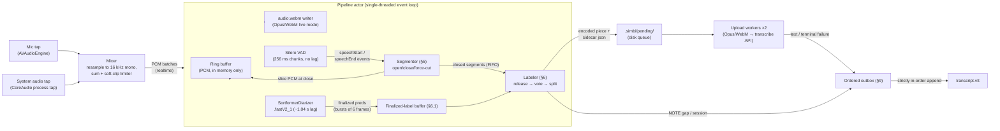
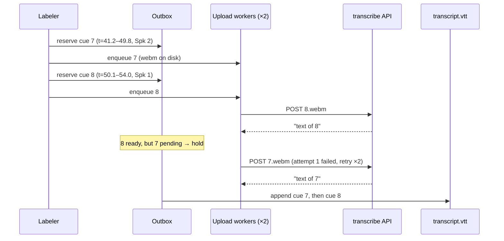

# Simbi Live Recording Algorithm

This document specifies the live recording pipeline of SimbiAudio **exactly**:
capture → VAD segmentation → diarizer labeling → transcription upload → WebVTT
append, plus stop/resume and failure handling. It is self-contained — an
engineer can implement the pipeline from this document alone. Where SPEC.md §3
is ambiguous or contradicts the FluidAudio library, the resolution is made
here and marked with a `> **Resolution:**` blockquote.

> **History:** this is the second-generation design. The first generation
> derived cut points from the diarizer's frame labels (run smoother + buffer
> manager, with glue/drop rules for short silences and upload-only edge pads
> compensating for the diarizer's ~0.5–1 s onset lag). It lost audio in
> exactly the cases the pads were meant to cover and needed a 14-row
> transition table to specify. This design removes the diarizer from the cut
> path entirely: **Silero VAD cuts, Sortformer labels.**

All cut arithmetic is in **samples** (16 kHz mono, session-local index).
Diarizer arithmetic is in **frames** (80 ms = 1 280 samples). VAD event
granularity is one **chunk** (256 ms = 4 096 samples).

---

## 0. Verified FluidAudio facts

Everything below was verified against FluidAudio 0.15.5 source, not the docs.
The implementation must not assume anything beyond this list.

### 0.A Sortformer (diarizer — labels only, never cuts)

Verified against `Sources/FluidAudio/Diarizer/Sortformer/*.swift` and
`Sources/FluidAudio/Diarizer/DiarizerTimeline.swift`.

1. `SortformerConfig.fastV2_1` exists: `chunkLen = 6`, `chunkLeftContext = 1`,
   `chunkRightContext = 7`, `sampleRate = 16000`, `subsamplingFactor = 8`,
   `melStride = 160`, `numSpeakers = 4`.
   Frame duration = `8 × 160 / 16000` = **exactly 0.08 s** (1 280 samples).
   Output latency = `(chunkLen + rightContext) × 0.08` = **1.04 s**.
2. `SortformerDiarizer.process()` returns `DiarizerTimelineUpdate?` — `nil`
   until a full chunk of features is available. Finalized frames therefore
   arrive in **bursts of 6 frames (480 ms)** or multiples.
3. `DiarizerTimelineUpdate.chunkResult` carries the raw finalized
   probabilities: `finalizedPredictions: [Float]` flattened
   `[frameCount, 4]`, plus `startFrame` = the session-local index of the
   first finalized frame in this update. Frame indices are **session-local**
   (they restart at 0 after `reset()` / a new diarizer instance).
4. Finalized frames are immutable — `StreamingUpdateResult.confirmed` "are
   final and will not change." Tentative predictions cover the right-context
   window and are replaced on every chunk.
5. `DiarizerTimelineConfig.sortformerDefault` has **no debounce**:
   `onset/offset = 0.5`, `minFramesOn = 0`, `minFramesOff = 0`. The library
   timeline's segment extraction is used **only** for the tentative live-UI
   indicator, never for cut or label decisions.
6. The timeline's own segment emission (`finalizedSegments` in updates) lags:
   a closed segment is held internally and only emitted on a later
   large-gap onset or batch-end condition, per speaker slot independently.
   > **Resolution:** the labeler consumes `chunkResult.finalizedPredictions`
   > (raw per-frame probabilities) and derives its own labels. It does
   > **not** consume `update.finalizedSegments`.
7. `finalizeSession()` drains only **full right-context chunks** and then
   absorbs the remaining tentative predictions as finalized. It does *not*
   pad trailing silence. Audio in the last ≲ 0.5 s may otherwise never be
   processed with full context.
   > **Resolution:** on stop, Simbi feeds `STOP_PAD_SEC` of zero samples to
   > the diarizer (only to the diarizer — never to `audio.webm` or the ring
   > buffer) before calling `finalizeSession()`, so every real sample is
   > covered by a full-context chunk. Frames at or beyond the end of real
   > audio are force-labeled SILENCE (§10.1).
8. `SortformerDiarizer` serializes access with an internal lock, but the
   type is documented "not thread-safe". All diarizer calls happen on the
   single pipeline actor (§2) regardless.
9. **Onset lag**: Sortformer's speech probability ramps up over ~0.5–1 s
   after a pause. This is why it must never gate which audio is uploaded —
   in this design its output can only affect *labels*, never extents.

Recommended construction (unchanged from generation 1):

```swift
let diarizer = SortformerDiarizer(
    config: .fastV2_1,
    timelineConfig: DiarizerTimelineConfig(
        numSpeakers: 4,
        frameDurationSeconds: 0.08,
        minFramesOn: 3,      // cosmetic: smooths the tentative live-UI only
        minFramesOff: 1,     // cosmetic
        maxStoredFrames: 0,  // don't accumulate prediction history
        storeSegments: false // we never read per-speaker stored segments
    )
)
```

### 0.B Silero VAD (cut authority)

Verified against `Sources/FluidAudio/VAD/VadManager.swift`,
`VadManager+Streaming.swift`, `VadTypes.swift`.

1. `VadManager` is a public **actor** wrapping a CoreML port of Silero VAD
   (`FluidInference/silero-vad-coreml`). `init(config:)` auto-downloads the
   model via `ModelHub` into
   `~/Library/Application Support/FluidAudio/Models` — the same download
   pattern as the diarizer models. FluidAudio marks the VAD "beta".
2. `VadManager.chunkSize = 4096` (**256 ms** at 16 kHz), plus a 64-sample
   context carried inside `VadState` between calls. `processChunk` pads a
   short final chunk by repeating its last sample and truncates oversize
   input — so the pipeline feeds exactly 4 096 samples per call except the
   final partial chunk at stop.
3. Streaming API: `processStreamingChunk(chunk, state:, config:)` returns
   `VadStreamResult { state, event?, probability }`. The hysteresis state
   machine (verified line-by-line):
   - Entry threshold = `VadConfig.defaultThreshold` (default **0.85**);
     exit threshold = entry − `negativeThresholdOffset` (default **0.15**,
     so exit at 0.70).
   - `probability ≥ entry` while untriggered ⇒ **`speechStart`** event with
     `sampleIndex = (start of the triggering chunk) − speechPadding·16000`,
     clamped ≥ 0. The pre-roll is applied by the library.
   - `probability < exit` while triggered starts the silence timer at that
     chunk's start; after `minSilenceDuration` of accumulated samples with
     no chunk back above entry ⇒ **`speechEnd`** event with
     `sampleIndex = (silence start) + speechPadding·16000` — i.e. the tail
     pad is applied by the library too.
   - Probabilities in the dead zone `[exit, entry)` keep the current
     trigger state and do **not** reset a running silence timer; only a
     chunk back at ≥ entry cancels it.
   - `processedSamples` in the state counts exactly the samples fed, so
     event `sampleIndex` values are in the same session-local sample space
     as the ring buffer, on 256 ms chunk granularity (± the padding).
4. The streaming path implements **only** onset/offset with padding and
   hangover. `minSpeechDuration` and `maxSpeechDuration` from
   `VadSegmentationConfig` are **not** enforced by
   `processStreamingChunk` — Simbi enforces its own max-segment cut (§5.3)
   and short-blip discard (§6.4).
5. `VadSegmentationConfig.init` debug-asserts
   `speechPadding ≤ minSpeechDuration`.
   > **Resolution:** Simbi wants `speechPadding = 0.30 s`, so it must also
   > pass `minSpeechDuration: 0.30` (harmless — unused by streaming, see
   > fact 4) or debug builds trap.

Simbi's construction:

```swift
let vad = try await VadManager(config: VadConfig())     // threshold 0.85
let vadSegConfig = VadSegmentationConfig(
    minSpeechDuration: 0.30,     // only to satisfy the padding assert
    minSilenceDuration: 0.75,    // HANGOVER_SEC
    speechPadding: 0.30          // SPEECH_PAD_SEC (pre-roll and tail)
)
var vadState = await vad.makeStreamState()               // per session
```

---

## 1. Constants

Every threshold in this document, in one place.

| Constant | Value | Seconds | Meaning |
|---|---|---|---|
| `SAMPLE_RATE` | 16 000 Hz | — | pipeline sample rate (mono Float32) |
| `FRAME_SAMPLES` | 1 280 | 0.08 | one diarizer output frame |
| `VAD_CHUNK_SAMPLES` | 4 096 | 0.256 | one Silero VAD decision |
| `VAD_THRESHOLD` | 0.85 | — | VAD entry threshold (library default) |
| `VAD_EXIT_OFFSET` | 0.15 | — | exit threshold = 0.85 − 0.15 = 0.70 |
| `SPEECH_PAD_SEC` | 0.30 | 0.30 | pre-roll before onsets and tail after offsets, applied by the VAD inside event indices |
| `HANGOVER_SEC` | 0.75 | 0.75 | VAD `minSilenceDuration`: quiet time that closes a segment |
| `MAX_SEGMENT_SEC` | 10.0 | 10.0 | open segment reaching this is force-cut (§5.3) |
| `MAX_CUT_LOOKBACK_SEC` | 3.0 | 3.0 | the forced cut lands on the lowest-probability chunk boundary this recent |
| `SPLIT_MIN_FRAMES` | 13 | 1.04 | a second speaker's merged run must reach this to split a segment (§6.3) |
| `MIN_PIECE_FRAMES` | 5 | 0.40 | split pieces shorter than this merge into a neighbor |
| `BLIP_MAX_SEC` | 0.25 | 0.25 | zero-speech segments with less voiced time than this are discarded |
| `NOISE_MIN_SEC` | 1.6 | 1.6 | zero-speech segments with at least this much voiced time are discarded |
| `GAP_NOTE_SEC` | 2.0 | 2.0 | uncovered note-time between cues ≥ this ⇒ `NOTE gap` |
| `STOP_PAD_SEC` | 2.0 | 2.0 | zeros fed to the diarizer (only) at stop |
| `RING_TARGET_SEC` | 15 | 15.0 | ring buffer target retention (growable, §8) |
| `IDLE_RING_GUARD_SAMPLES` | 16 000 | 1.0 | samples retained behind the write head while no segment is open |
| `UPLOAD_CONCURRENCY` | 2 | — | parallel uploads |
| `UPLOAD_MAX_ATTEMPTS` | 3 | — | per segment |
| `UPLOAD_BACKOFF` | 1 s, 4 s | — | delay before attempts 2 and 3 |
| `UPLOAD_TIMEOUT_SEC` | 30 | — | per HTTP request |
| `OPUS_BITRATE` | 24 000 bps VBR | — | mono, 20 ms Opus frames, WebM container |

Sample/frame → time mapping (**normative**):

```
frame f (session-local) covers samples [f·1280, (f+1)·1280)   (session-local)
note_time_seconds(sample s)      = session_base_seconds + s / 16000
session_base_seconds             = session_base_samples / 16000
session_base_samples             = total samples written to audio.webm by all
                                   previous sessions (0 for session 1)
```

VTT timestamps are formatted from seconds with millisecond rounding:
`ms = round(seconds × 1000)`.

---

## 2. Architecture and dataflow

Single-writer design: everything after capture runs on **one pipeline actor**
processing events in order. There are no cross-thread races by construction.

The division of labor, which the rest of this document elaborates:

- **Silero VAD** answers "when is anyone making sound?" — a pure timing
  question it answers with zero model lag. It owns every silence-based cut.
- **Sortformer** answers "who is speaking?" — after a segment is closed and
  its frames are finalized. It owns speaker labels and the one remaining cut
  it is qualified to make: splitting a segment that contains a no-pause
  speaker switch (imprecise timing there costs a label smudge, never audio).



Each incoming PCM batch is delivered to exactly four sinks, in this order:

1. **Ring buffer** (§8) — raw samples, memory only.
2. **audio.webm writer** — samples → Opus → WebM cluster append. This file is
   the timestamp ground truth; it contains *all* audio including silences.
3. **VAD accumulator** — buffers to 4 096-sample chunks; each full chunk goes
   through `processStreamingChunk`; any event feeds the segmenter.
4. **Diarizer** — `addAudio()` then `process()`; a non-nil update appends
   finalized labels to the label buffer and may release pending segments.

---

## 3. Data model and invariants

**Segment** — one VAD-delimited stretch of sound, produced by the segmenter:
`{startSample, endSample, forcedCut: Bool, stopCut: Bool, pcm}` with
`endSample` exclusive. Invariants:

- `startSample ≥` the previous segment's `endSample` (the pre-roll is clamped
  — segments never overlap and are emitted in order).
- `endSample − startSample ≤ MAX_SEGMENT_SEC·16000 + VAD_CHUNK_SAMPLES`
  (force-cut bound, one chunk of detection granularity).
- The PCM is sliced from the ring **at close time**; a closed segment owns
  its samples and never touches the ring again.

**Frame label** — per finalized diarizer frame: `SILENCE` or `SPEECH(slot)`,
`slot ∈ {0,1,2,3}` (§4). Labels are consumed only by the labeler.

**Piece** — the labeler's output; one piece = one cue = one upload:
`{range: [a, b) samples, speaker, continuation: Bool}`. Invariants:

- Pieces partition their segment's range exactly (splits create no cracks
  and no overlaps); across segments, ranges are disjoint and ascending.
- **Cue extents = upload extents.** There is exactly one coordinate range
  per piece; the audio the ASR hears is the audio the cue claims. A cue may
  therefore include up to `SPEECH_PAD_SEC` of room tone at each edge —
  a click-to-seek lands a beat early, which reads as natural.

**Cue** — one piece with its transcription:
`cue = {index, startSec, endSec, speaker, continuation, text?}`. Invariants:

- `index` is a monotonically increasing integer, unique across all sessions
  of the note (persisted as `nextCueIndex` in `.simbi/state.json`).
- `startSec/endSec` = note time of the piece's range, `endSec` clamped to
  `realAudioEndSec` (§10.1).
- Cues never overlap and are strictly increasing in `startSec` in file
  order. Indices in the file are gapless (discards happen before a cue
  index is assigned, §6.4).

**Gap** — uncovered note-time ≥ `GAP_NOTE_SEC` between consecutive coverage
(previous piece end → next piece start, or session edges). Rendered as a
`NOTE gap` block. The audio of a gap exists in `audio.webm`; it is simply
not covered by any cue. Unlike generation 1, a gap is *derived from
coverage*, not from a discarded-silence bookkeeping object.

**Session** — one start/stop of recording. `{n, baseSamples, wallStart,
wallEnd}`. Note-timeline is contiguous across sessions: session n+1's sample 0
maps to `baseSeconds = baseSamples/16000`, immediately after session n's last
sample.

---

## 4. Frame labeling

Input: one finalized frame's probabilities `p[0..3]` from
`chunkResult.finalizedPredictions`.

```
active = { s | p[s] ≥ 0.5 }
label  = SILENCE                if active == ∅
       = SPEECH(argmax_s p[s])  otherwise      # tie → lowest slot index
```

No probability smoothing, no run debouncing — generation 1's run smoother is
gone. Label flicker is harmless here because labels are only ever *aggregated*
(majority votes over whole segments, §6.2–§6.3), never used edge-by-edge.

---

## 5. Segmenter (VAD-driven, sample domain)

State — the complete list:

```
open:               {startSample, probHistory}?   # nil = idle
pendingContinuation Bool                          # set by a forced cut
lastCoverageEnd     Int                           # end of the last emitted piece
                                                  # (samples; 0 at session start)
vadState            VadStreamState                # library-owned
vadPending          [Float]                       # < 4096 samples awaiting a chunk
```

`probHistory` is a ring of the last `⌈3.0 / 0.256⌉ = 12` chunk probabilities
with their start samples, kept only while a segment is open.

### 5.1 Chunk processing

```
on pcmBatch: vadPending += samples
while vadPending.count ≥ 4096:
    chunk = vadPending.removeFirst(4096)
    result = vad.processStreamingChunk(chunk, state: vadState, config: vadSegConfig)
    vadState = result.state
    if open != nil: open.probHistory.append(result.probability, chunkStart)
    handle(result.event)                      # §5.2
    if open != nil: checkForcedCut()          # §5.3
```

### 5.2 Event handlers

```
on speechStart(s):                    # s already includes the 0.30 s pre-roll
    open = {startSample: max(s, lastCoverageEnd), probHistory: []}

on speechEnd(e):                      # e already includes the 0.30 s tail
    close(end: min(e, writeHead), stopCut: false)

close(end, stopCut):
    guard open != nil, end > open.startSample else { open = nil; return }
    segment = {startSample: open.startSample, endSample: end,
               forcedCut: false, stopCut: stopCut,
               pcm: ring.slice(open.startSample ..< end)}
    labeler.enqueue(segment)
    open = nil
```

That is the entire silence rule. There is no glue, no drop, no discard
threshold, no pad arithmetic: silence simply never opens a segment, and a
segment closes `HANGOVER_SEC` after its last sound (detected at 256 ms
granularity). The `NOTE gap` for a long break falls out of coverage
accounting in §6.5 — the segmenter does not track silences at all.

### 5.3 Forced cut (`checkForcedCut`)

```
if chunkEnd − open.startSample ≥ MAX_SEGMENT_SEC·16000:
    cut = start sample of the minimum-probability entry in probHistory
          (the lowest-confidence 256 ms of the last ~3 s — the most
           pause-like instant available)
    if cut ≤ open.startSample: cut = chunkEnd        # true hard cut
    emit segment {open.startSample, cut, forcedCut: true, stopCut: false,
                  pcm: ring.slice(...)}  → labeler
    pendingContinuation = true
    open = {startSample: cut, probHistory: []}       # remainder stays open;
                                                     # no pads at a forced cut —
                                                     # neighbors abut exactly
```

### 5.4 Stop

On stop (full procedure in §10.1): feed the final partial `vadPending` chunk
to the VAD (the library right-pads it internally, fact 0.B.2); if a segment
is still open, `close(end: realSamples, stopCut: true)`.

---

## 6. Labeler (diarizer-driven, frame domain)

The labeler is a **pure function plus a FIFO**: given a closed segment and
the finalized labels covering it, it emits pieces. It never consults the
ring, the clock, or the VAD.

### 6.1 Label buffer and release

```
on diarizer update (chunk):
    assert chunk.startFrame == nextFrameIndex      # own counter, must agree
    for i in 0..<chunk.finalizedFrameCount:
        f = chunk.startFrame + i
        labels[f] = (f ≥ realFrameEnd) ? SILENCE : labelOf(predictions, i)  # §4
    nextFrameIndex += chunk.finalizedFrameCount
    ui.updateTentative(update.tentativeSegments)   # display only

    while let seg = fifo.first, seg.endSample ≤ nextFrameIndex·1280:
        fifo.removeFirst(); release(seg)           # §6.2
```

Release therefore happens ≤ ~1.5 s after a segment closes (1.04 s diarizer
latency + 0.48 s burst granularity), and inherently in segment order — the
outbox receives cues already ordered. Consumed label entries (below the
oldest pending segment's start frame) are evicted; the buffer stays O(seconds).

### 6.2 Speaker assignment

```
release(seg):
    F = frames overlapping [seg.startSample, seg.endSample)
        = floor(start/1280) ..< ceil(end/1280)
    votes[s] = |{ f ∈ F : labels[f] == SPEECH(s) }|
    if Σ votes == 0: apply the discard rule (§6.4); if kept:
        speaker = argmax_s Σ_{f∈F} p[s][f]          # mean-probability argmax
        if degenerate (all ≈ 0): speaker = previous cue's speaker, else slot 0
        emit as one piece
    else: run the split check (§6.3)
```

The majority vote runs over the segment's **entire** finalized extent, so
Sortformer's slow onset ramp at the head of a segment is simply outvoted by
its confident middle. A late diarizer can no longer exclude audio — the
worst it can do is mislabel a segment it barely saw.

### 6.3 Split check (the diarizer's one cut)

Runs only when `votes` has ≥ 2 nonzero slots.

```
1. runs = maximal same-slot sequences over the SPEECH frames of F, where
   same-slot runs separated only by SILENCE frames merge into one run.
2. while ∃ run shorter than SPLIT_MIN_FRAMES (13 = 1.04 s):
       merge the shortest such run into its longer neighbor
       (attribution bleed accepted — text is preserved, only the label
        of a sub-second stretch can be wrong).
3. if one run remains: one piece, speaker = that slot.
4. else: split points between consecutive runs r_i → r_{i+1}:
       if SILENCE frames separate them: the midpoint frame of that silence
       else: r_{i+1}'s first frame
   converted to samples (frame·1280) and clamped inside (start, end).
   Pieces shorter than MIN_PIECE_FRAMES·1280 merge into their neighbor.
5. Pieces partition [startSample, endSample) exactly; each piece's speaker
   is its run's slot. Split pieces never carry `continuation`.
```

The split points are frame-granular (80 ms) while segment edges are
VAD-granular; both are exact sample indices by the time they reach the
outbox, so downstream code has one coordinate system.

### 6.4 Discard rule (the only audio the ASR does not hear)

A released segment with **zero** diarizer speech frames is discarded — no
cue, no upload, coverage not advanced — iff its voiced duration
`(endSample − startSample)/16000 − 2·SPEECH_PAD_SEC` is:

- `< BLIP_MAX_SEC` (0.25 s) — a VAD blip (door slam, click), **or**
- `≥ NOISE_MIN_SEC` (1.6 s) — sustained non-speech sound (typing, music
  from system audio): long enough that Sortformer, whose weakness is onset
  *timing* rather than wholesale misses, would have flagged real speech.

Zero-speech segments **between** those bounds (0.25–1.6 s voiced) are kept
and uploaded with the fallback label of §6.2 — that window is exactly where
Sortformer's onset lag could plausibly blind it to a real short utterance,
and losing a "yes" is worse than one wasted API call. `stopCut` segments
are never discarded by the `≥ NOISE_MIN_SEC` arm (evidence may be
truncated); the blip arm still applies. Discarded audio still exists in
`audio.webm` and falls inside a `NOTE gap` (§6.5).

### 6.5 Coverage, gaps, continuation, emission

```
for piece in pieces:                       # in order
    if noteTime(piece.start) − noteTime(lastCoverageEnd) ≥ GAP_NOTE_SEC:
        outbox.append(gapNote(lastCoverageEnd → piece.start))
    continuation = pendingContinuation && piece is the segment's first piece
                   && piece.speaker == previous cue's speaker
    pendingContinuation = false
    reserve cue(nextCueIndex++, piece.range, piece.speaker, continuation)
    encode piece.pcm subrange → .simbi/pending/{index}.webm (+ sidecar json)
    uploadQueue.enqueue(index)
    lastCoverageEnd = piece.end
```

A 10-minute break costs zero API calls and produces exactly one
`NOTE gap` — not because a rule detected a long silence, but because no
segment existed and coverage accounting noticed the hole.

---

## 7. Pipeline event loop (top level)

```
on pcmBatch(samples):                     # from mixer, ~10 ms batches
    ring.append(samples)                  # session-local sample index
    webmWriter.append(samples)            # → Opus → cluster
    realSamples += samples.count
    vad: accumulate + process full chunks (§5.1)
    diarizer.addAudio(samples)
    if let update = try diarizer.process():
        labeler.consume(update.chunkResult)    # §6.1 (may release segments)
```

`realFrameEnd = ceil(realSamples / 1280)` becomes finite only during stop
(§10.1); during live recording it is ∞.

Both models are awaited on the pipeline actor; both run far faster than
realtime (the VAD is a ~1 MB LSTM). Event-ordering rules are unnecessary:
the segmenter and labeler share no state — closed segments flow one way
through a FIFO.

### Latency budget (informative)

After a speaker stops: `HANGOVER_SEC` (0.75) + ≤ 1 chunk detection (0.256)
until close; release when finalized frames cover `endSample` — the tail pad
(0.30) plus 1.04 s lag plus ≤ 0.48 s burst ≈ 1.8 s after the last word,
whichever of close/release is later dominates ⇒ **upload starts ~1.8–2.1 s
after speech stops** (generation 1: ~3.0 s), plus encode + API round-trip
for text on screen.

---

## 8. Ring buffer and slicing

Ring of Float32 samples with **absolute session-local indexing**: `append`
advances `writeHead`; `slice(a, b)` returns samples `[a, b)` and must never
fail for any slice the segmenter requests.

Eviction floor (the oldest sample that must be retained):

```
floor = open.startSample                                if a segment is open
      = max(0, writeHead − IDLE_RING_GUARD_SAMPLES)     otherwise
```

The idle guard (1.0 s) covers the worst-case back-dating of a future
`speechStart`: the 0.30 s pre-roll plus one 256 ms chunk of detection
granularity plus accumulator jitter — 1 s is comfortably above it. Closed
segments hold their own PCM (§5.2), so pending/released segments never pin
the ring.

Eviction: drop samples below `floor`, but keep capacity ≥ `RING_TARGET_SEC`.
The ring may **grow** beyond the target rather than ever evicting above the
floor; log a warning if retention exceeds `RING_TARGET_SEC` (it means
inference is stalling).

**Retention bound.** An open segment spans at most `MAX_SEGMENT_SEC` (10 s)
plus one chunk before the forced cut fires, so
`writeHead − floor ≤ 10.256 s ≈ 164 100 samples ≈ 656 KB`.
`RING_TARGET_SEC = 15` leaves ~4.7 s of slack for scheduling jitter before
the ring must grow; correctness never depends on the target.

Slicing is pure arithmetic and happens exactly once per segment, at close.

---

## 9. Upload pipeline and ordered VTT append

### 9.1 Outbox (single writer for transcript.vtt)

The outbox is an ordered list of entries created **synchronously** by the
pipeline actor, in note-timeline order:

- `sessionNote(start|end)` — ready immediately.
- `gapNote(start, end)` — ready immediately.
- `cue(cueIndex)` — ready when its transcription reaches a terminal state
  (success with text, or failure → text `[inaudible]`).

Writer loop: while the head entry is ready, append it to `transcript.vtt`
(single atomic append per entry, then notify the UI watcher) and pop it.
The file is therefore always valid WebVTT after every append, and cues appear
strictly in timestamp order regardless of upload completion order.



Head-of-line blocking is intentional and bounded: a stuck segment resolves in
at most `3 attempts × (30 s timeout) + 1 s + 4 s ≈ 95 s` to a terminal state.

### 9.2 Upload worker

```
worker loop:
    cueIndex = uploadQueue.next()
    meta = read pending/{cueIndex}.json
    for attempt in 1...UPLOAD_MAX_ATTEMPTS:
        POST pending/{cueIndex}.webm to
             https://chatgpt.com/backend-api/transcribe
             Content-Type: audio/webm;codecs=opus (multipart, filename codex.webm)
             Authorization: Bearer <~/.codex/auth.json access_token>
             ChatGPT-Account-Id / originator / User-Agent per Codex Desktop
        on success: outbox.fulfill(cueIndex, response.text); delete pending files; break
        on failure: meta.attempts += 1; persist; sleep UPLOAD_BACKOFF[attempt]
    if all attempts failed: outbox.fulfill(cueIndex, "[inaudible]")
                            # keep pending files for post-hoc retry tooling
```

Auth-missing / 401: pause the queue, surface the banner, retry the whole
queue on recovery — entries and order are on disk, nothing is lost.

An upload whose transcription returns empty/whitespace text fulfills as
`[inaudible]` like a failure — it was sound the ASR heard nothing in.

### 9.3 VTT emission format

```
WEBVTT

NOTE simbi note="2026-07-15 Standup"

NOTE session 1 start=2026-07-15T13:40:00+09:00 offset=00:00:00.000

1
00:00:00.000 --> 00:00:04.000
<v Speaker 1>So the main thing for today is the pipeline refactor.

NOTE gap start=00:00:09.600 end=00:00:12.640

NOTE continuation

5
00:01:02.480 --> 00:01:08.400
<v Speaker 2>…and that is why the second half of this sentence continues here.
```

- Cue identifier = the integer `cueIndex`.
- A cue flagged `continuation` is preceded by a `NOTE continuation` block
  (machine-readable hint to the fixer that this cue continues the previous
  same-speaker cue mid-sentence).
- `NOTE gap` / `NOTE session` formats are fixed as shown; times use the same
  `HH:MM:SS.mmm` format as cue timings.
- The `key=value` form is deliberate: WebVTT forbids the substring `-->`
  inside comment blocks (a parser would treat the line as a cue timing), so
  NOTE payloads must never contain it.

---

## 10. Stop and resume

### 10.1 Stop

```
1. Stop capture; drain the mixer; deliver final pcmBatch(es).
2. realFrameEnd = ceil(realSamples / 1280)      # now finite
   realAudioEndSec = sessionBaseSeconds + realSamples / 16000
3. Feed the final partial VAD chunk (if any); if a segment is still open,
   close it at realSamples with stopCut = true (§5.4).
4. Feed STOP_PAD_SEC (= 32 000 samples) of zeros to the diarizer ONLY
   (not to ring, not to webm, not to the VAD). Call diarizer.process().
5. try diarizer.finalizeSession(); consume its update (§6.1). All frames
   f ≥ realFrameEnd are force-labeled SILENCE. Finalized coverage now
   reaches realFrameEnd, so every pending segment releases.
6. If realAudioEndSec − noteTime(lastCoverageEnd) ≥ GAP_NOTE_SEC:
   outbox.append(gapNote(lastCoverageEnd → realSamples)).
7. outbox: append `NOTE session n end=<wallclock> offset=<realAudioEndSec>`.
   (This entry queues behind pending cues like everything else.)
8. Flush the final WebM cluster; update .simbi/state.json:
   {nextCueIndex, sessionCount, totalSamples: baseSamples + realSamples,
    lastSessionEnd: wallclock}.
```

The stop-pad guarantees every real frame is finalized with full right
context; pad frames themselves are force-silenced and can never affect
labels (`endSec` clamping additionally caps any cue at real audio).

### 10.2 Resume (same note, later)

```
1. Verify audio.webm exists and its scanned duration matches
   state.json.totalSamples (±1 cluster). Mismatch ⇒ refuse resume (UI error).
2. sessionBaseSamples = state.json.totalSamples; nextCueIndex from state.json.
3. Fresh SortformerDiarizer (or reset()) — streaming state is cold; slot
   numbering may differ from the previous session. Cross-session speaker
   unification is the fixer thread's job (out of scope here); `NOTE session`
   blocks mark the boundaries it needs.
4. Fresh VAD stream state (makeStreamState()), fresh segmenter and labeler
   (session-local indices restart at 0; only noteTime() carries the base
   offset). lastCoverageEnd = 0.
5. outbox: append `NOTE session n start=<wallclock> offset=<baseSeconds>`.
6. Continue as a normal session. Cue numbering continues monotonically.
```

A stop/resume adds **zero** note-timeline time: session n+1's first sample
lands at exactly `state.json.totalSamples / 16000` seconds.

### 10.3 Crash recovery (note open after an unclean stop)

Triggered at note-open when `state.json` records a session with no recorded
end (the app died mid-recording).

```
1. Scan audio.webm's clusters; drop a truncated trailing cluster.
   recoveredSamples = total decoded sample count of the surviving clusters.
2. lastCueEndSec = endSec of the last cue in transcript.vtt (0 if none).
   totalSamples  = max(recoveredSamples, ceil(lastCueEndSec · 16000))
3. Rewrite state.json: {totalSamples, sessionCount,
   lastSessionEnd: session wallStart + (totalSamples − baseSamples)/16000
   (estimate — the true wall-clock end is unknowable after a crash)}.
4. Re-enqueue every entry in .simbi/pending/ into the upload queue and
   outbox in cueIndex order (see §11's crash-ordering note).
5. Append `NOTE session n end=<estimated wallclock>
   offset=<totalSamples/16000>` to the VTT.
6. The note is now resumable per §10.2.
```

Step 2's clamp is what preserves the cues-never-overlap invariant (§3)
across a crash: cues flushed just before the crash may reference audio that
lived only in the dropped trailing cluster, so the recovered audio can be
*shorter* than the last cue's end. Basing the next session at
`lastCueEndSec` instead of the recovered audio end means session n+1's cues
can never overlap them. The timeline hole `[recoveredSamples, totalSamples)`
has no audio backing — it is bounded by one cluster; playback seeks into it
snap forward to the next cluster (the resumed session's first one).
§10.2 step 1's duration check compares the scanned duration against
`totalSamples` with a ±1-cluster tolerance, which the hole is bounded by,
so a recovered note passes it.

---

## 11. Failure handling

| Failure | Behavior |
|---|---|
| Upload fails 3× / times out | cue text `[inaudible]`, timeline stays complete; encoded webm kept in `.simbi/pending/` for later manual retry |
| Auth expired / ChatGPT.app missing | upload queue pauses (disk-backed), banner shown; drains on recovery; recording/diarization unaffected |
| Uploads slower than cuts | queue depth grows on disk, never in memory; ordering unaffected |
| Diarizer inference stall | segments keep closing on time (VAD is independent); they wait in the FIFO and release late — cues arrive late but identical. Ring unaffected (segments own their PCM) |
| VAD inference stall | ring grows past target (warning logged); no audio ever dropped; cuts arrive late but with identical results (the VAD state machine is deterministic in the sample stream) |
| App crash mid-recording | `audio.webm` valid (live-mode; truncated trailing cluster dropped on open); `transcript.vtt` valid (atomic per-entry appends); recovery per §10.3: `state.json.totalSamples` recomputed from the cluster scan and clamped to the last cue's `endSec` (cues never overlap across the crash), pending uploads re-enqueued from `.simbi/pending/`, a synthesized `NOTE session n end` appended; note is resumable |
| Fixer writes invalid VTT | out of scope here (renderer keeps last good state; next fixer ping includes a repair instruction) |
| > 4 speakers | Sortformer hard limit; extra speakers merge into existing slots — documented limitation |
| Speech quieter than the VAD threshold throughout | not segmented, not uploaded (it is at ambient-noise level — the ASR would hear nothing either); still recorded in `audio.webm` |

Crash-recovery ordering subtlety: cues whose uploads were in flight at crash
time re-enter the outbox in `cueIndex` order ahead of any new session's
entries (their indices are smaller), so the strictly-in-order rule holds
across the crash.

---

## 12. Worked scenarios

Scenarios are specified as **scripted inputs** — VAD stream events (with
their sample indices, as the library would emit them: pads included, chunk
granularity) and finalized diarizer frame labels — because that is exactly
how the unit tests drive the engine. The engine is deterministic in these
inputs (§13.7). Times are note-timeline seconds of session 1 (base 0).

### 12.1 Two speakers alternating across a short pause

Speaker A speaks 0.5–3.0 s; 1.2 s pause (> HANGOVER, < GAP_NOTE); B speaks
4.2–7.0 s; stop at 8.0 s (`realSamples = 128 000`).

Input events: `speechStart(3 200)` (0.5 − 0.3 pre-roll = 0.20 s),
`speechEnd(52 800)` (3.0 + 0.3 tail = 3.30 s), `speechStart(62 400)`
(4.2 − 0.3 = 3.90 s), `speechEnd(116 800)` (7.30 s).
Labels: frames 8–37 → SPEECH(0), frames 55–87 → SPEECH(1), rest SILENCE.

- Segment 1 `[3 200, 52 800)`: votes {0: 30}, one piece, Speaker 1.
  → cue 1 `00:00:00.200 → 00:00:03.300`.
- Segment 2 `[62 400, 116 800)`: votes {1: 33}, one piece, Speaker 2.
  → cue 2 `00:00:03.900 → 00:00:07.300`.
- Coverage hole 3.30 → 3.90 s = 0.6 s < 2.0 ⇒ **no** gap note. The pause
  needed no rule at all — no glue, no drop, no pads.
- Trailing hole 7.30 → 8.00 s = 0.7 s < 2.0 ⇒ no gap note at stop.

### 12.2 Monologue crossing 10 s

One speaker, continuous speech 0–14.5 s, stop at 15.0 s. VAD:
`speechStart(0)` (pre-roll clamped at 0), no `speechEnd` until stop.

- At the chunk whose end first reaches `startSample + 160 000` (10.0 s), the
  forced cut fires. Suppose the minimum-probability chunk of the last 12
  started at sample 143 360 (8.96 s — a breath): segment 1 = `[0, 143 360)`,
  `forcedCut`, reopen at 143 360, `pendingContinuation = true`.
- Stop at 15.0 s closes segment 2 = `[143 360, 240 000)` with `stopCut`.
- Labels: SPEECH(0) throughout ⇒ cue 1 `00:00:00.000 → 00:00:08.960`
  (Speaker 1); cue 2 `00:00:08.960 → 00:00:15.000` (Speaker 1), preceded by
  `NOTE continuation`. The neighbors share sample 143 360 exactly: no
  overlap, no crack, no pads.

### 12.3 A 7 s pause (the generation-1 bug case)

A speaks 0–3.0 s, silence 3.0–10.0 s, A resumes 10.0–12.0 s, stop 12.5 s.

Input events: `speechStart(0)`, `speechEnd(52 800)` (3.30 s),
`speechStart(155 200)` (10.0 − 0.3 = 9.70 s), `speechEnd/stop` at 12.5 s ⇒
segment 2 ends `min(12.3 + …, realSamples)` — say `speechEnd(196 800)`
(12.30 s). Labels: frames 0–37 SPEECH(0); frames ~131–150 SPEECH(0) —
**note the resumed onset labels may start ~1 s late (frame 131 ≈ 10.5 s)
because of Sortformer's ramp; it does not matter.**

- Segment 1 `[0, 52 800)` → cue 1 `00:00:00.000 → 00:00:03.300`, Speaker 1.
- Segment 2 `[155 200, 196 800)`: the segment extent came from the VAD, so
  it contains all of the resumed speech from 9.70 s **regardless of when
  the diarizer noticed it** — the late labels only vote. Cue 2
  `00:00:09.700 → 00:00:12.300`, Speaker 1.
- Coverage hole 3.30 → 9.70 s = 6.4 s ≥ 2.0 ⇒
  `NOTE gap start=00:00:03.300 end=00:00:09.700`.
- Generation 1 lost the first ~1 s of the resumed speech whenever its
  pad-arming rule didn't cover the case; here there is no rule to miss —
  the upload starts 0.3 s *before* the audible onset by construction.

### 12.4 Interruption: B cuts A off with no pause

A speaks 0–4.0 s, B interrupts seamlessly 4.0–7.0 s, stop 7.5 s.
Events: `speechStart(0)`, `speechEnd(116 800)` (7.30 s) — one segment.
Labels: frames 0–49 SPEECH(0), frames 50–91 SPEECH(1).

- votes {0: 50, 1: 42}: two runs, both ≥ SPLIT_MIN_FRAMES. No silence
  between runs ⇒ split at run 2's first frame: 50·1280 = 64 000 (4.00 s).
- Piece 1 `[0, 64 000)` → cue 1 `…0.000 → …4.000`, Speaker 1.
  Piece 2 `[64 000, 116 800)` → cue 2 `…4.000 → …7.300`, Speaker 2 — not a
  continuation. If Sortformer placed the switch ~200 ms late, a word edge
  lands in the wrong cue's audio: a label smudge; every word is still
  transcribed.

### 12.5 Discards

- A 0.2 s door slam: segment ≈ 0.8 s with the two 0.3 s pads, voiced
  0.2 s < BLIP_MAX_SEC, zero SPEECH frames ⇒ discarded (blip arm). No cue
  index consumed.
- 30 s of typing during a break: VAD segments it (possibly several
  segments); each has zero SPEECH frames and voiced ≥ 1.6 s ⇒ discarded
  (noise arm). Coverage never advances, so the whole stretch folds into
  one `NOTE gap` when real speech resumes.
- A 0.5 s "yes" the diarizer entirely missed (inside its onset-lag blind
  spot): zero SPEECH frames but voiced 0.5 s ∈ [0.25, 1.6) ⇒ **kept**,
  uploaded, labeled by mean-probability argmax (fallback: previous cue's
  speaker).

---

## 13. Invariant checklist (for tests)

1. **Tiling within segments**: a segment's pieces partition
   `[startSample, endSample)` exactly — no overlap, no crack.
2. **Disjoint ascending coverage**: across all pieces of a session,
   ranges are pairwise disjoint and strictly ascending; every piece's
   start ≥ the previous piece's end. Cue timestamps inherit this.
3. **Cue = upload**: the sample range encoded into `pending/{i}.webm` is
   byte-for-byte the range the cue's timestamps claim (one coordinate
   system; no pad bookkeeping to verify).
4. **VAD authority**: segment extents depend only on the VAD event stream
   and `realSamples` — never on diarizer output. (Test: permute labels
   arbitrarily; extents must not change.)
5. **Label authority**: piece speakers and split points depend only on
   finalized labels over the segment's extent — never on the VAD
   probabilities.
6. **Discard safety**: a discarded segment has zero SPEECH frames and
   voiced duration outside `[BLIP_MAX_SEC, NOISE_MIN_SEC)`; `stopCut`
   segments are never noise-discarded. Everything else the VAD caught is
   uploaded exactly once.
7. **Determinism**: identical (VAD event stream, finalized predictions,
   `realSamples`) ⇒ identical cues, gaps, and notes. No clocks, no I/O in
   the segmenter/labeler.
8. **Gap accounting**: a `NOTE gap` is emitted iff consecutive coverage
   (or a session edge) leaves ≥ `GAP_NOTE_SEC` uncovered, and gaps never
   overlap cues.
9. **Cue indices** are gapless and monotone across sessions (discards
   happen before index assignment).
10. **Stop**: after §10.1, no segment is open, the FIFO is empty, every
    cue's `endSec ≤ realAudioEndSec`, and `state.json.totalSamples` equals
    the audio.webm sample count.
11. **Ring floor**: no slice ever touches an evicted sample; while idle,
    retention behind the write head is bounded by `IDLE_RING_GUARD_SAMPLES`
    (+ capacity slack); while open, by the forced-cut bound (§8).
12. **audio.webm completeness**: every ingested sample is in the file —
    segmentation shapes uploads only.
